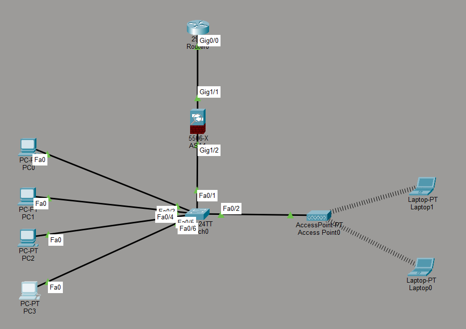
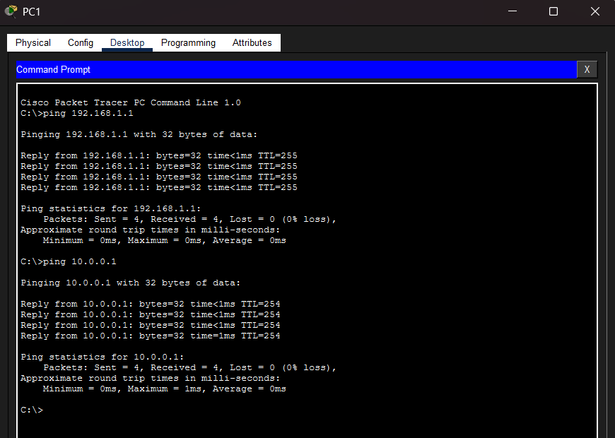

# ApexGlobal-Secure-Network-Infrastructure
A secure mid sized enterprise network implemented in Cisco Packet Tracer, featuring a Cisco ASA 5506 Firewall and routing infrastructure.

In this lab, I designed and configured a secure network for a small IT Department from scratch using Cisco Packet Tracer. To protect internal devices, I integrated a Cisco ASA 5506 Firewall between the local network and the Core Router.

## 1. Network Topology

---

## 2. Network Requirements & IP Setup

* **Wired Endpoints:** 4 Corporate PCs connected directly to the local switch via cables.
* **Wireless Endpoints:** 2 Corporate Laptops connected wirelessly to the network via an Access Point.
* **Security Rule:** All internal traffic must go through the firewall first before reaching the router or external networks.

### IP Addressing Table:

| Device | Interface | IP Address | Subnet Mask | Default Gateway |
| :--- | :--- | :--- | :--- | :--- |
| **Router** | `Gig0/0` | `10.0.0.1` | `255.255.255.252` | N/A |
| **Firewall (Outside)** | `Gig1/1` | `10.0.0.2` | `255.255.255.252` | `10.0.0.1` |
| **Firewall (Inside)** | `Gig1/2` | `192.168.1.1` | `255.255.255.0` | N/A |
| **All PCs** | `FastEthernet` | `192.168.1.10 - 13` | `255.255.255.0` | `192.168.1.1` |
| **All Laptops** | `Wireless` | `192.168.1.20 - 21` | `255.255.255.0` | `192.168.1.1` |

---

## 3. Device Configurations (CLI Commands)

### A. Router CLI Configuration
Below are the commands used to configure the Cisco 2911 Core Router, including the return route for the internal LAN:

<pre>
Router> enable
Router# configure terminal
Router(config)# hostname Apex-Router
Router(config)# interface GigabitEthernet 0/0
Router(config-if)# ip address 10.0.0.1 255.255.255.252
Router(config-if)# no shutdown
Router(config-if)# exit
</pre>

### B. Firewall CLI Configuration
Below are the commands used to configure the Cisco ASA 5506 Stateful Firewall, including global ICMP packet inspection:

<pre>
ciscoasa> enable
Password: 
ciscoasa# configure terminal
ciscoasa(config)# hostname Apex-Firewall

! --- Configuring the Inside Interface ---
ciscoasa(config)# interface GigabitEthernet 1/2
ciscoasa(config-if)# nameif inside
ciscoasa(config-if)# security-level 100
ciscoasa(config-if)# ip address 192.168.1.1 255.255.255.0
ciscoasa(config-if)# no shutdown
ciscoasa(config-if)# exit

! --- Configuring the Outside Interface ---
ciscoasa(config)# interface GigabitEthernet 1/1
ciscoasa(config-if)# nameif outside
ciscoasa(config-if)# security-level 0
ciscoasa(config-if)# ip address 10.0.0.2 255.255.255.252
ciscoasa(config-if)# no shutdown
ciscoasa(config-if)# exit
</pre>

---

## 4. Verification & Step-by-Step Troubleshooting

During testing from PC0 to verify network connectivity, I encountered and resolved two networking issues:

### Issue 1: Firewall Dropping Returning ICMP Replies
* **Symptom:** Pinging the Firewall Inside interface (192.168.1.1) was successful, but pinging the upstream Core Router (10.0.0.1) resulted in a "Request timed out" error.
* **Cause:** By default, Cisco ASA Firewalls statefully block traffic returning from a lower security zone (Outside, level 0) to a higher security zone (Inside, level 100).
* **Resolution:** I modified the ASA's default global policy map to statefully inspect and allow ICMP traffic.

<pre>
Apex-Firewall(config)# policy-map global_policy
Apex-Firewall(config-pmap)# class inspection_default
Apex-Firewall(config-pmap-c)# inspect icmp
</pre>

### Issue 2: Continued Timeouts Due to Missing Return Route
* **Symptom:** Even after configuring ICMP inspection on the firewall, the ping to the router (10.0.0.1) still timed out.
* **Cause:** The Core Router received the ping requests successfully, but it did not have a routing table entry for the 192.168.1.0/24 subnet. Therefore, it did not know how to route the reply packets back to the internal LAN (Asymmetric Routing / Blackhole).
* **Resolution:** I configured a static route on the Core Router, pointing all traffic destined for the 192.168.1.0/24 network back to the firewall's outside interface (10.0.0.2).

<pre>
Apex-Router(config)# ip route 192.168.1.0 255.255.255.0 10.0.0.2
</pre>

### Final Result:
After applying both fixes, end-to-end connectivity was successfully established. Pings from internal hosts now seamlessly traverse the firewall, reach the upstream router, and safely return.

### Command Prompt Ping Test Screenshot:

